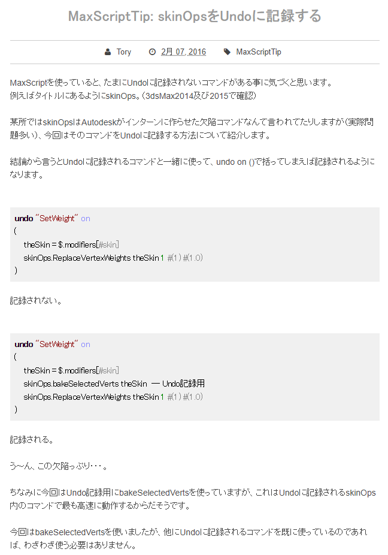
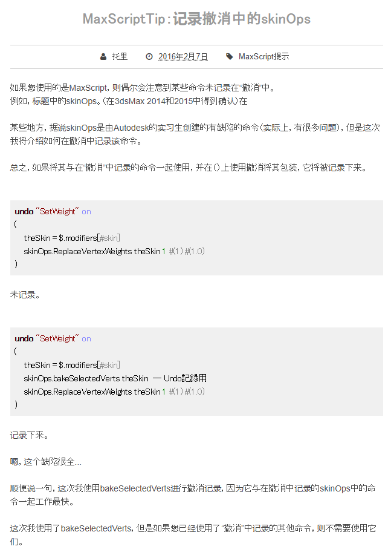

文章内容

日常使用MaxScript的一些经验记录.平常用于动画工具和绑定工具比较多,记录也会更偏向于这方面.

#### 一

editpoly修改器,不能像别的修改器那样,通过mxs完美复制...

导致一些效果无法实现

#### 二

在开发weightspro时,使用spinner控件实现权重微调,但是苦恼于不能将多次微调合并记录在一次撤销里.

经过一番搜索,发现可以用thehold相关方法来实现,这样调节微调器时,只有最后一次输入会触发撤销机制,其中的部分都会忽略,非常符合预期.但是测试完成实际使用时,把测试函数替换成我自己的函数就会无效,多次调试后发现主要问题来自于skinops.只要用了相关命令,撤销系统就会像消失了一样毫无反应.

经过搜索,发现很多人也遇到过这个问题.偶然在一篇帖子([MaxScriptTip: skinOpsをUndoに記録する](http://trtoolsjp.blogspot.com/2016/02/maxscript-skinopsundo.html))中发现,可以利用maxscript的一些机制,强制使相关代码进入撤销机制中.这里使用的是bakeSelectedverts.

有一些人说这段设计是实习生留下的bug. 我强行将其加入撤销机制,结果带来了严重的内存和性能问题.才发现其实像上面那样设计是有原因的:设置权重之类的操作太繁琐了,每个操作都被记录进撤销缓存会严重消耗内存和性能,所以只在有需要的时候撤销一次.也就是通过bakeSelectedverts来扣一个戳记,忽略掉其他权重操作的记录,在撤销时仍能回到bakeSelectedverts之前.

### 三

`with redraw off(code)`

可以方便的让一段代码执行过程中关闭重绘

有些时候,需要我会这么用

`with redraw off(animat off(undo off(code)))` 或者

`with redraw off(animat off(undo off(at time 0 (code))))` 

### 四

用 `at time 0 (code)` 可以更方便的控制临时的时间,省去大部分的 `slidertime = 0; ......`,而且at time 是不重绘的,还可以超过现有的时间范围.

获取时间需配合 `currenttime`

不过在处理biped系统的物体时,一些情况下会有刷新问题.

