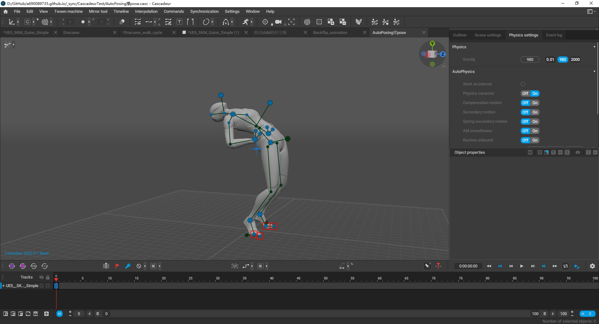
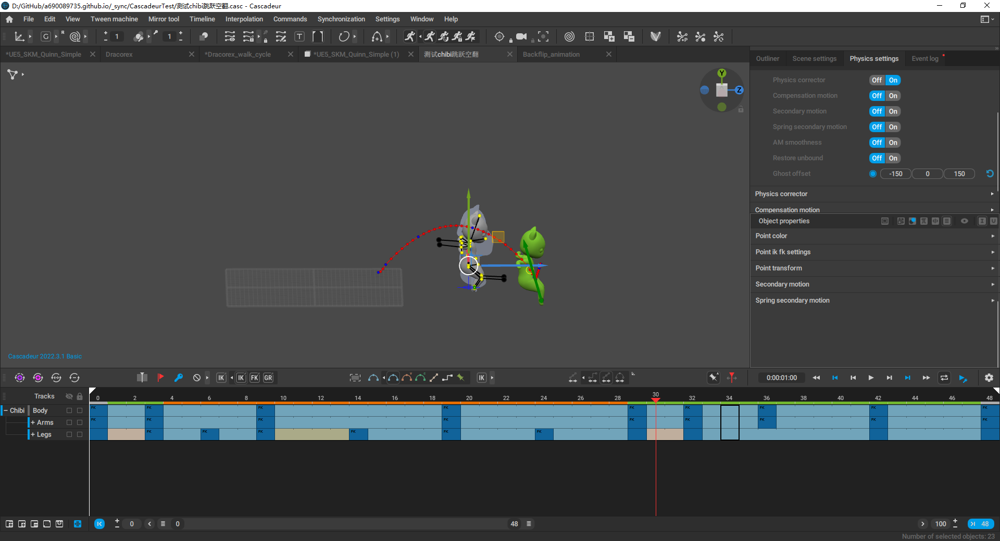

## 目前测试项目

基本内容(完成)

- [x] 基本操作和基本概念
- [x] 单角色转手腕测试(全身IK控制性)
- [x] 单角色复刻官方快速案例(简单侧跳示例)
- [x] 单角色官方教程复刻跳跃(普通跳,和在普通跳的基础上添加空翻)

深入内容(待定)

- [ ] 官方进阶教程学习
- [ ] 自动次级动画功能测试
- [ ] 角色自定义绑定(目前用的都是软件自带的部分)
- [ ] 复杂舞蹈的动画测试
- [ ] 带双手交换武器的技能动画测试
- [ ] 带有大量装备和飘带的角色的动画测试

## 简评

**用法**
	①手动制作关键帧,②修改关键帧类型和插值类型,③使用自动物理功能矫正运动量,④使用各种微调方法优化动画效果.

**感受**
	与其说是AI动画,使用起来感觉更像全身IK+特殊的过渡算法,可能这个算法与AI算法有相似之处.但这个软件不像StableDiffusion那样可以基本脱离手工操作.
	资产制作仍然基于手动制作关键帧和手动优化运动效果,总体上和传统动画制作差别不大,主要区别在于其大量的动画相关的辅助功能.(比如全身IK绑定,几种简化的插值模式,设置循环帧,区间编辑模式,几种轨迹模式,自动地面锁定,弹道轨迹预览,自动物理,自动次级动画等等)
	这些功能可以帮助动画师快速创建质量不错的动画.而且利用好自动物理,新手也能很容易完成质量不错的动画.不过一切的基础仍然取决于手动创建的关键帧和手动优化的过渡效果.这在这个软件的概念里是一大优点,因为可以有很大的定制自由.
	需要注意的是,全身IK的K帧方式和传统方式有一定区别,需要一定的学习才能适应.而且Cascadeur的控制器结构与传统理念也有差别,需要单独学习并加以注意,否则会出现意料之外的效果.
	cascadeur里最出彩的部分是自动物理功能,从`测试chibi跳跃空翻.casc`文件中,能明显的看到,手动k帧后,过渡不顺滑的地方,自动物理可以将现有的动量匀呼一下,动画师只要考虑怎么配合自动物理效果,就能产出质量不错的动画.

**应用**
	探讨过用于动作捕捉动画的可能性,但这个软件和其配套工具更适合处理手动动画流程.
	这个软件存在利用其他DCC工具产出粗版资源再细化的可能,需要自己建立工作流程,但感觉不比直接在cascadeur里面制作会更有优势.
	**目前看来,最优的使用路线,是把一些要求不是特别高,设计不是特别复杂的动画,用这个软件直接制作输出.预计会有不错的效果.**但还没测试过身上有大量装备时的动画效果,仅角色本身时,动画效果相当不错,整体看起来比较舒服.
